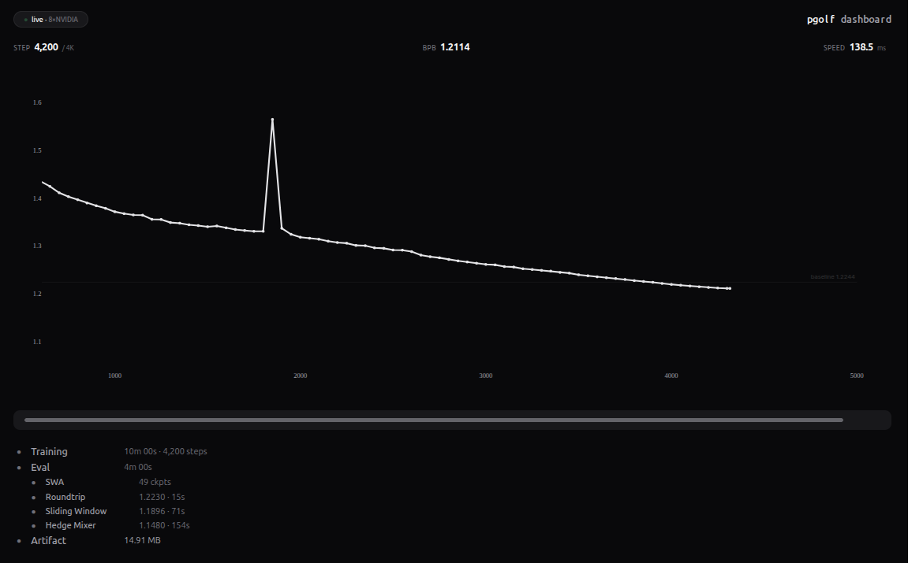

# pgolf dashboard

Real-time training monitor for [Parameter Golf](https://github.com/openai/parameter-golf) runs. Single Python file, no build step, no configuration needed.



## Quick Start

```bash
pip install -r requirements.txt
python3 dashboard.py --ssh "root@host -p 1234"
```

Open the URL printed to stdout (includes auth token). Replace `root@host -p 1234` with your RunPod TCP SSH connection string.

No changes to your training script needed — the dashboard parses standard `train_gpt.py` output.

## Usage

```bash
# Monitor remote RunPod pod (auto-detects latest .log in /workspace/)
python3 dashboard.py --ssh "root@host -p 1234"

# Monitor specific log file on remote pod
python3 dashboard.py --ssh "root@host -p 1234" --remote-log /workspace/train.log

# Monitor multiple pods simultaneously
python3 dashboard.py --ssh "root@pod1 -p 1234" --ssh "root@pod2 -p 5678"

# View local log file
python3 dashboard.py train.log

# Compare two runs (overlay on chart)
python3 dashboard.py train.log --compare baseline.log

# Custom baseline reference line on chart
python3 dashboard.py train.log --baseline 1.10

# Auto-stop pod when training completes (saves log locally first)
python3 dashboard.py --ssh "root@host -p 1234" --auto-stop --save-dir ./logs

# Discord/Slack notifications on completion or BPB threshold
python3 dashboard.py --ssh "root@host -p 1234" \
  --notify-webhook https://discord.com/api/webhooks/... \
  --notify-threshold 1.10

# Custom host and port
python3 dashboard.py --host 0.0.0.0 --port 3000
```

You can also upload `.log` files via the **+** button in the browser, or drag & drop them onto the page.

## CLI Reference

| Flag | Default | Description |
|------|---------|-------------|
| `logs` (positional) | — | Local `.log` files to display |
| `--ssh` | — | SSH connection string (repeatable for multi-pod) |
| `--remote-log` | `LATEST` | Log path on remote host |
| `--compare` | — | Comparison log files (overlay on chart) |
| `--baseline` | auto | BPB baseline reference line (auto-derives from first val_bpb if unset) |
| `--host` | `127.0.0.1` | Bind address |
| `--port` | `8050` | Server port |
| `--refresh` | `180` | Auto-refresh interval in seconds |
| `--auto-stop` | off | Save log and stop RunPod pod when training completes |
| `--save-dir` | `.` | Directory to save logs on auto-stop |
| `--notify-webhook` | — | Discord/Slack webhook URL for notifications |
| `--notify-threshold` | — | Send notification when BPB crosses below this value |
| `--insecure-host-key` | off | Use `StrictHostKeyChecking=no` (not recommended) |

## What It Shows

### During Training
- Val BPB chart with baseline reference line (configurable via `--baseline`)
- Step count, current BPB, speed (ms/step)
- Progress bar counting down from max wallclock (10 min default)
- Warmup detection

### During Eval
- Progress bar switches to 10-min eval budget countdown
- Turns red if eval exceeds the time limit
- Stage tracker — each phase appears as it completes:

```
● Training         10m 00s · 4,600 steps
● Eval             4m 15s
  ● SWA              43 ckpts
  ● Roundtrip        1.2168 · 14s
  ● Sliding Window   1.1832 · 76s
  ● Hedge Mixer      1.1324 · 159s
  ● Artifact         15.40 MB
```

Only stages present in the log are shown — works with any eval pipeline.

### Crash Detection

Automatically detects OOM errors, tracebacks, and killed processes. Shows the error excerpt in the UI and sets the progress bar to red.

### SSH Health

When monitoring via SSH, a status pill shows connection health:
- Green — connected and fetching
- Amber — stale (2+ consecutive failures)
- Red — failing (5+ consecutive failures), shows error text

### Charts

All chart lines are monochrome (matching the current theme) with different dash styles (solid, dash, dot, dashdot) to distinguish runs. Primary run is full opacity, overlays are dimmed.

### Themes
Click the logo to cycle: **dark** (default) → **kitty** (pink/black) → **emerald** (green/peach). Each theme has its own font and chart colors. Preference saved to localStorage.

### LATEST Mode
`--remote-log LATEST` (the default) finds the most recently modified `.log` in `/workspace/`. When a new run starts, the dashboard switches to it automatically — no restart needed.

### Auto-stop
With `--auto-stop`, the dashboard saves the log locally and stops the RunPod pod when training completes. The pod is matched by SSH host IP — never stops the wrong pod. Requires [runpodctl](https://github.com/runpod/runpodctl) installed locally.

## API

All endpoints (except `/healthz`) require `?token=` parameter. The token is generated on startup and printed to stdout.

| Endpoint | Method | Auth | Description |
|----------|--------|------|-------------|
| `/` | GET | no | Dashboard UI (token embedded in page) |
| `/api/data` | GET | yes | All run data + config |
| `/api/upload` | POST | yes | Upload a `.log` file (max 50 MB) |
| `/api/remove` | POST | yes | Remove a run by key |
| `/api/log` | GET | yes | Raw log text (plain text) |
| `/healthz` | GET | no | Health check: version, uptime, SSH status |

## Security

- Binds to `127.0.0.1` by default — only accessible from your machine
- Auth token required on all data endpoints
- No shell interpolation — all SSH commands use argv lists
- Upload filenames sanitized server-side
- SSH host key verification enabled (`StrictHostKeyChecking=accept-new`)
- XSS prevention via DOM API (no `innerHTML` with user data)

## Requirements

- Python 3.10+
- `fastapi`, `uvicorn`, `python-multipart` (`pip install -r requirements.txt`)
- Internet for CDN (Plotly.js, Google Fonts) on first page load
- SSH access to remote pod (optional, for remote monitoring)

## Log Compatibility

Parses standard `train_gpt.py` output from the parameter-golf challenge:

```
model_params:23662344
world_size:8 gpu:NVIDIA H100 80GB HBM3
max_wallclock_seconds:600.000
warmup_step:5/20
step:100/20000 train_loss:2.5000 train_time:10000ms step_avg:100.00ms
step:100/20000 val_loss:2.3000 val_bpb:1.3600
swa: averaging 44 checkpoints
Serialized model int8+zstd22: 15403955 bytes
final_roundtrip_exact val_loss:2.0545 val_bpb:1.2168
final_sliding_window_exact val_loss:1.9978 val_bpb:1.1832
final_hedge_mixer_exact val_loss:1.9120 val_bpb:1.1324
```

Unrecognized lines are silently ignored — safe to use with any fork or modified script.

## Tips

- Use the **TCP SSH** connection from RunPod (not the proxy one), e.g. `root@203.0.113.1 -p 12345`
- Refresh rate: 10s for short runs, 3min for long runs — auto-detected
- If SSH drops, dashboard shows cached data until reconnection
- Logs are fetched incrementally (`tail -c`) to minimize bandwidth on long runs

## License

MIT
